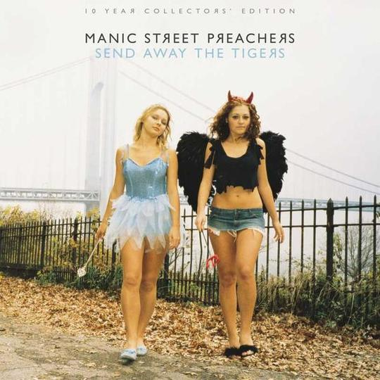

# Manic Street Preachers



将官方[gfwlist](https://github.com/gfwlist/gfwlist)所下载到的`gfwlist.txt`，转换成 Shadowsocks 所使用的 gfwlist.js。

## 环境需求

```shell
  nodeJs >= 8.0.0
```

## 使用方法

```shell
  npm i
  npm start
```

将在文件夹内得到 gfwlist.js 以供使用。

## 命名由来

> 狂躁街道传教者（Manic Street Preachers，大陆译名：街头传教士），常被簡稱為狂躁者（The Manics）是一隊來自英國威爾士的搖滾樂團，成立於1989年，他們是1990年代晚期英國最大的樂團。雖然他們在早期時的音樂風格偏向龐克搖滾，但現在他們的曲風通常被歸類為另類搖滾。他們最為人熟知的是瘋狂的早期生涯，團員里奇·爱德华兹（原名理查德·詹姆斯·爱德华兹）失蹤並疑似自殺。在政治上他們是堅定的社會主義人士—這種立場是受到他們在西威爾士的教育影響（他們在1980年代發生的「礦工暴動」事件中長大），在他們的歌詞中常出現高度的政治內容，以及常常參與相關的行動（他們曾經將一個獎項獻給亞瑟·斯卡吉爾（Arthur Scargill），他是「國家礦工工會」和「社會勞工黨」的領袖）。他們在古巴的演出也大受歡迎。
